# La Reconquista Del Paladar #

## Índice ##

1. [Fase 1](#id1)
2. [Fase 2](#id2)
3. [Fase 3](#id3)
4. [Fase 4](#id4)


## Fase 1 <a name="id1"><a> ##
### Descripción general ###
Se desarrollará una aplicación web destinada a la venta de comida latinoamericana a domicilio, en la que los usuarios podrán navegar por las diferentes categorías de las comidas ofertadas sin necesidad de registrarse. Para formalizar el pedido deberán iniciar sesión con su usuario y completar su compra.

### Entidades principales ####
- Producto: Cada producto llevará asociado un identificador único, y contendrá datos específicos que lo describan junto al número de stock. 
- Cliente: Cada ususario tendrá su propio nombre de usuario, que será unico para cada uno, a parte de otros datos como su dirección y otros datos personales. El usuario podrá realizar de 0 a N pedidos.
- Pedido: esta entidad tendrá asociada un numero de productos y un usuario, asociandolos. Esta entidad tambien contendrá el coste final total.
- Categoría de productos: esta entidad llevará asosciado un identificador único y contendrá de 1 a N productos que se recojan en ella.

### Descripción servicio interno ###
\- Cuando el usuario hace un pedido se le enviará un correo electrónico con un pdf donde se incluirá el resumen de su pedido.

\- Servicio de pago online.


### Autores ###

**Roberto Adrián Toaza Castro**
- ra.toaza.2016@alumnos.urjc.es
- GII + GIC 129
- ##### Github: [RoberToaza](https://github.com/RoberToaza)


## Fase 2 <a name="id2"></a> ##

### Desarrollo en local ###
#### Diagrama de Navegación ####


#### Diagrama UML ####


#### Diagrama E/R ####


#### Home Principal ####


#### Home (Privado) ####


#### Menú (Público) ####


#### Menú (Privado)####


A diferencia del menú anterior. este dispone de un botón para poder añadirlo al carrito del usuario.

#### Carrito (Privado) ####


#### Contacto (Publico/Privado) ####

Lo único que diferencia a estos dos es que en uno puedes hacer login en la barra nav y en el otro aparece tu nombre de usuario

#### Info (Privado) ####


#### Registrarse como usuario (Publico) ####
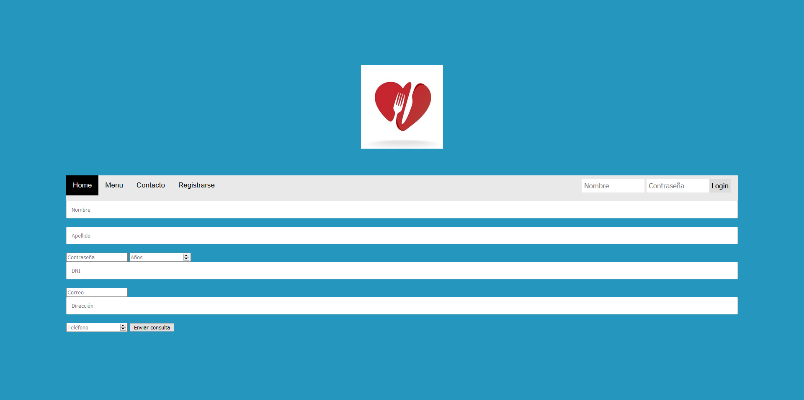


## Fase 3 <a name="id3"></a> ##

Nueva Navegación haciendo una verdadera diferencia entre el usuario podrá acceder de forma pública (sin login) y después de hacer login

### Diagrama de nueva navegación ###
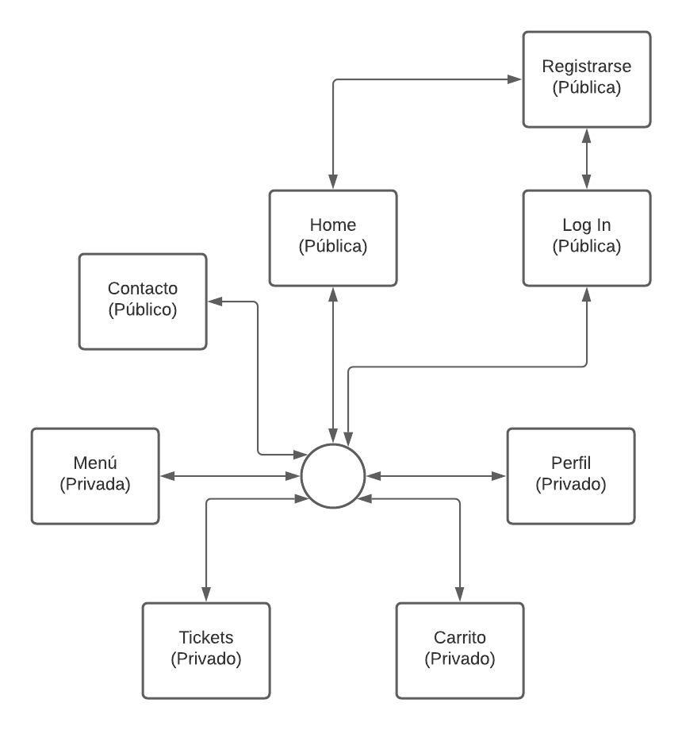


#### Home Principal (Público) ####
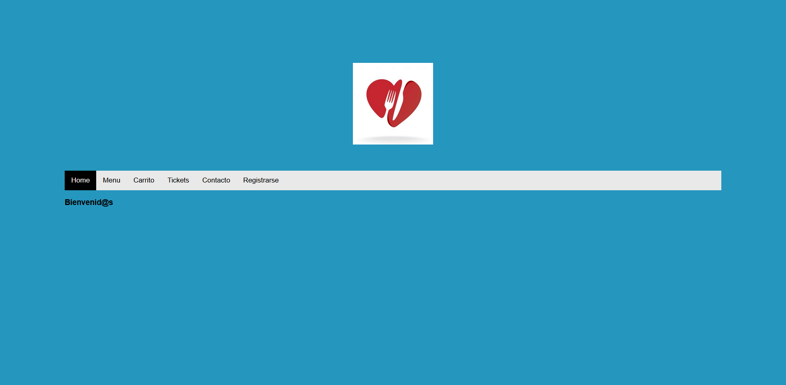

#### Log In (Público) ####
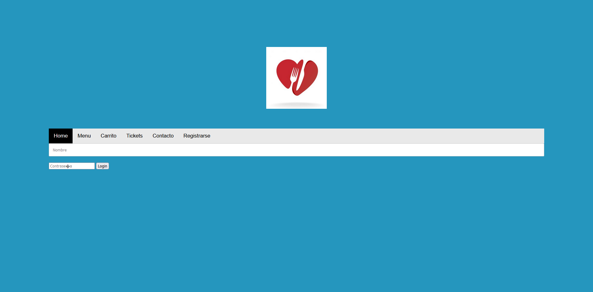

Esta pantalla aparecerá siemrpe que se quiera acceder a alguna parte privada, y después de hacer log in, se redireccionará a donde quería acceder en una primera instancia.

#### Sign Up (Público) ####
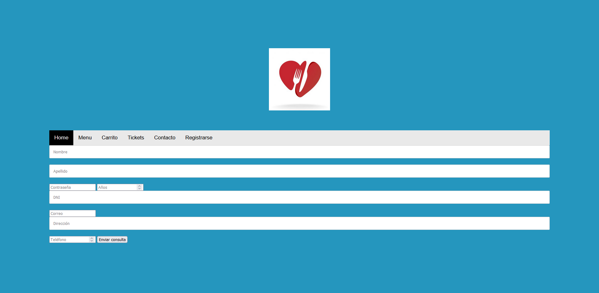

Esta solo se mostrará desde las pantallas públicas ya que luego su acceso desaparecerá.

#### Contacto (Público) ####
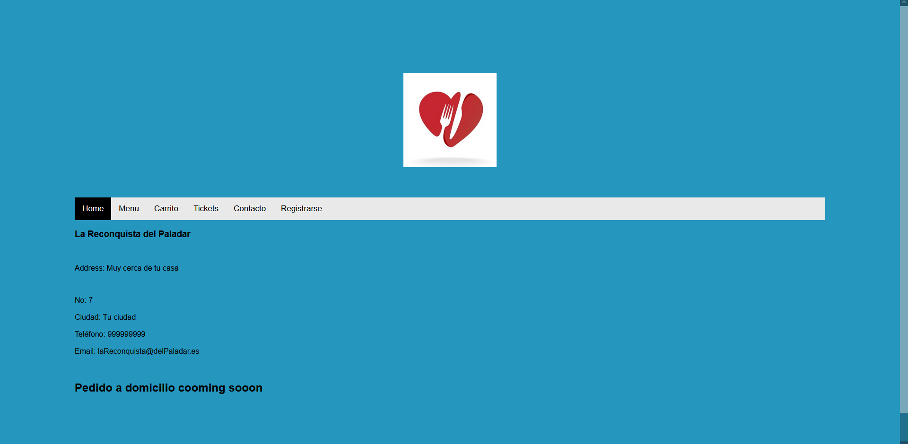

#### Menú (Privado) ####
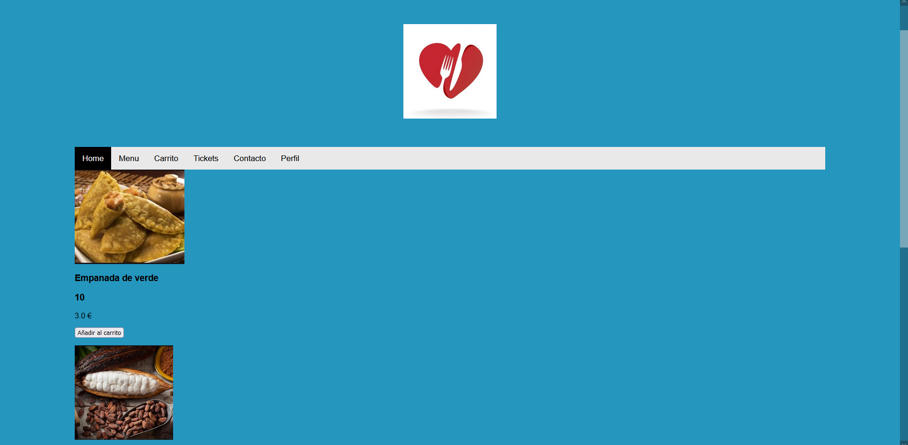

#### Carrito (Privado) ####
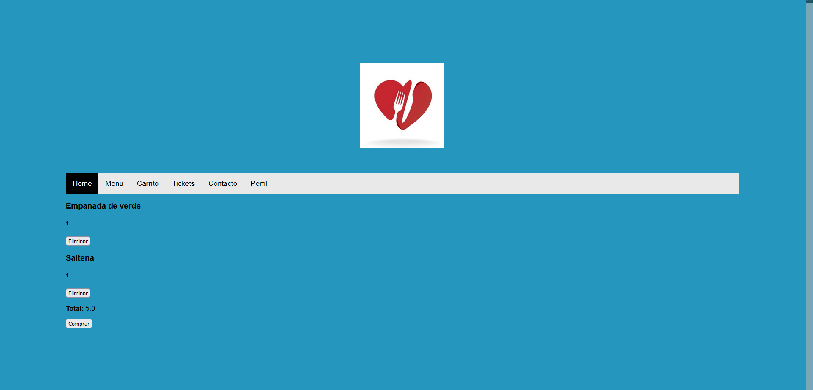

#### Tickets (Privado) ####
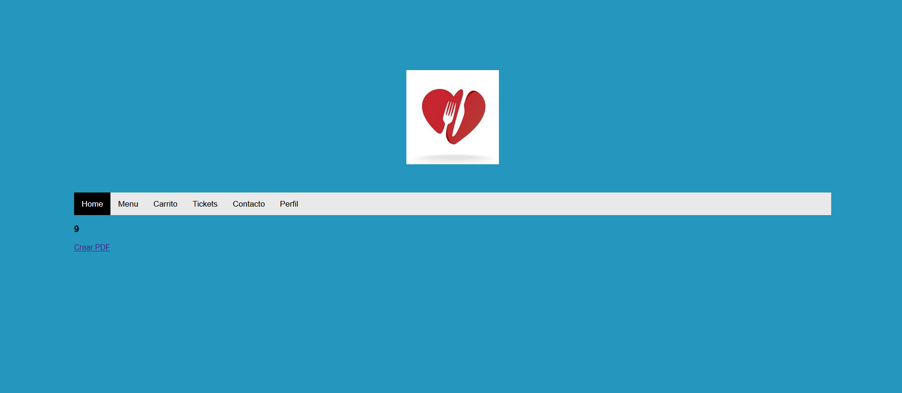

#### Perfil (Privado) ####
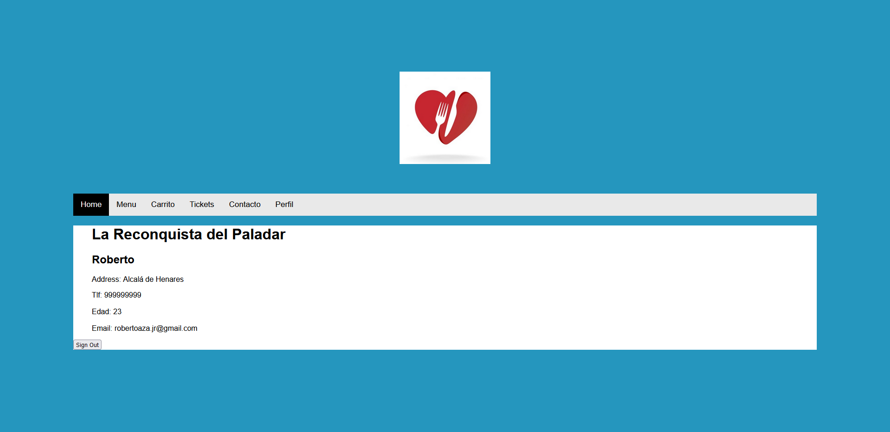

### Diagrama de Clases ###
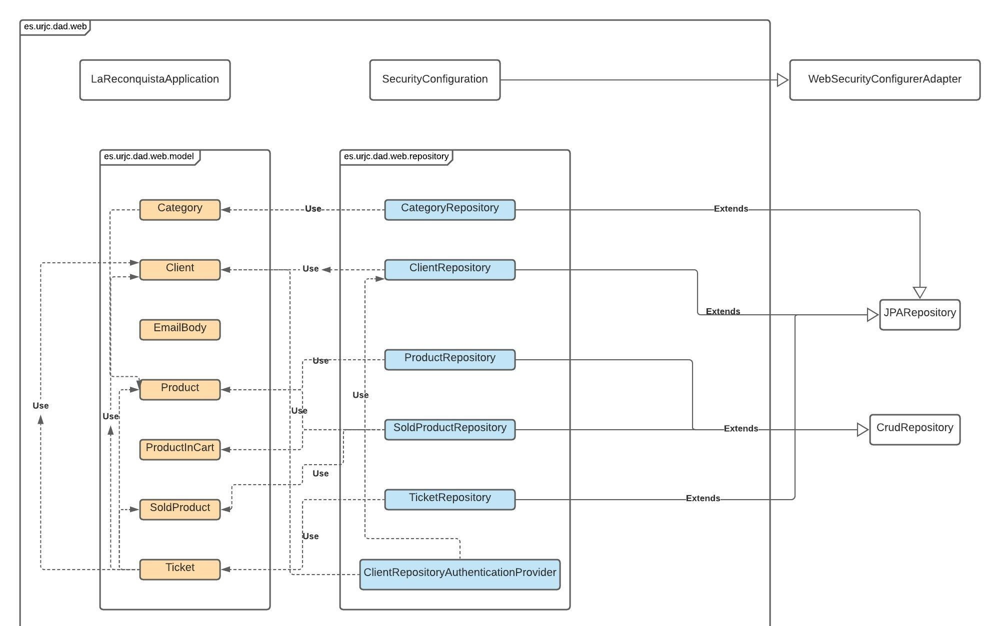
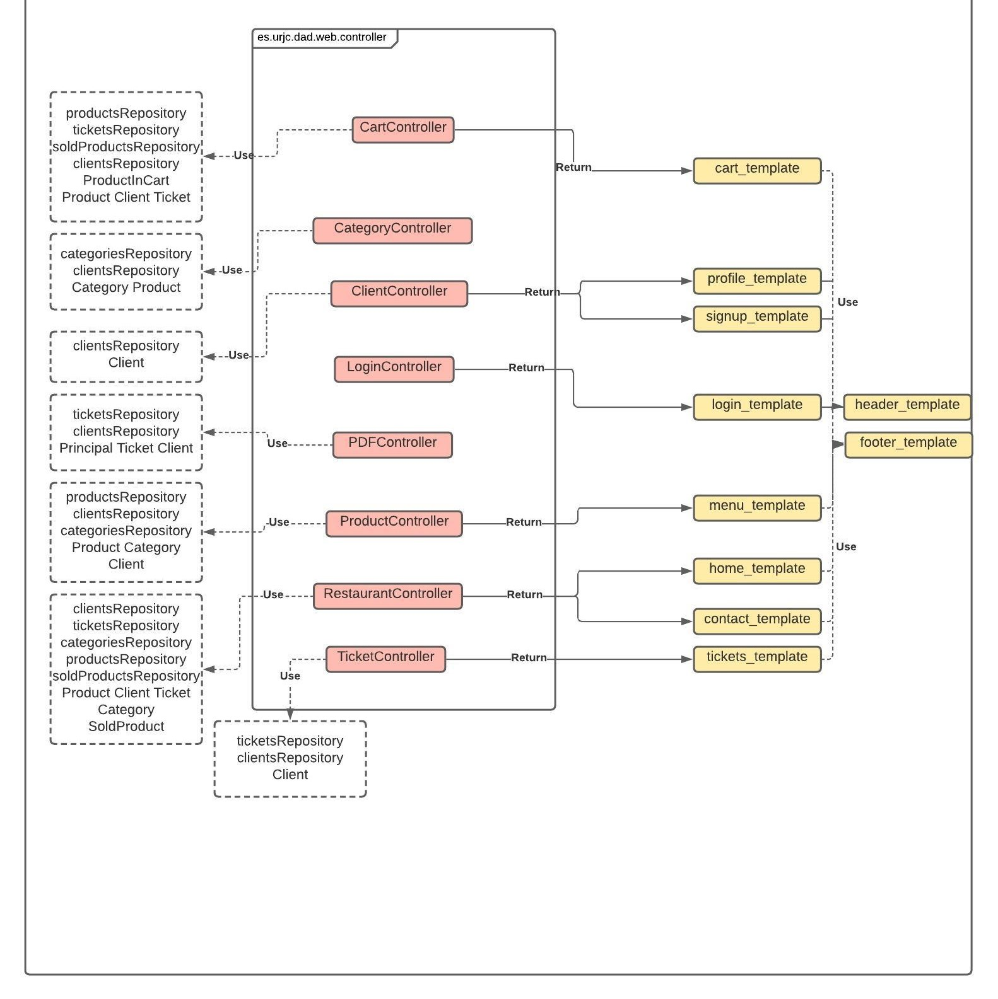


##### Servicio Interno #####

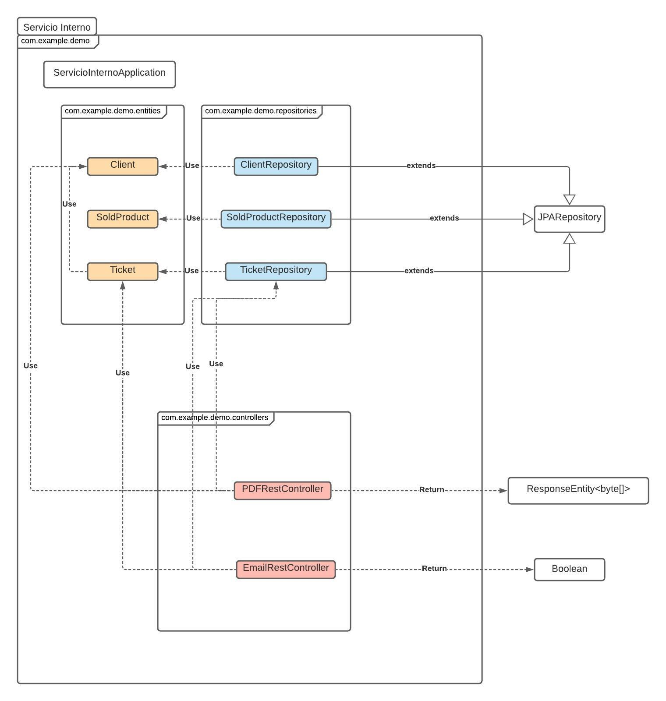


### Despliegue ####

Para el despliegue de la aplicación, se necesitará tener instalado docker en su máquina así como java.

Primero arrancaremos la base de datos con la siguiente línea


Para comprobar su versión de java 

```
$ docker run --rm -e MYSQL_ROOT_PASSWORD=pass -e  MYSQL_DATABASE=lareconquista -p 3306:3306 -d mysql
```

Una vez hecho este paso nos colocaremos en la carpeta target tanto del servicio interno como de la página web y abriremos un terminal ahí ejecutaremos la siguiente linea

```
$ java -jar "nombredel jar"
```

Si no ejecuta comprobaremos la versión de java:

```
$ java --version
```

Si no funciona hay que instalar mínimo la versión 8 de java:

```
$ sudo add-apt-repository ppa:openjdk-r/ppa
$ sudo apt-get update
$ sudo apt-get install openjdk-8-jdk
```

## Fase 4 <a name="id4"></a> ##

### Vídeo despliegue ###

[](https://youtu.be/iFM8ulg1cVI)

### Diagrama de Clases ###

El cambio mas significativo ha sido que ahora tenemos un controlador para la caché


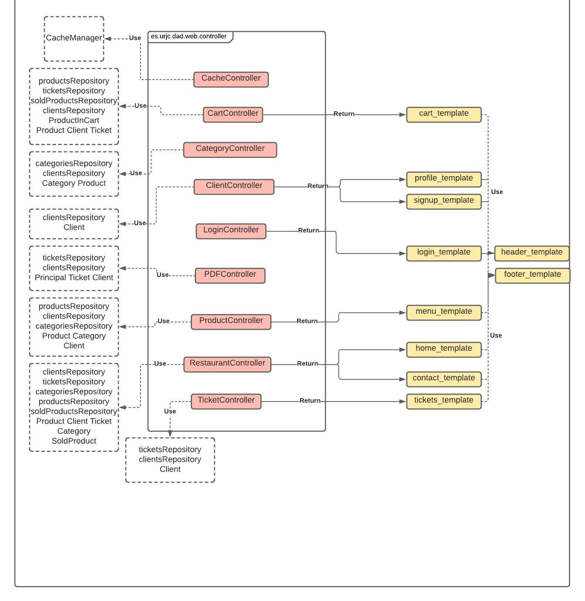


##### Servicio Interno #####


### Despligue ###

La aplicación seguirá los siguientes esquémas

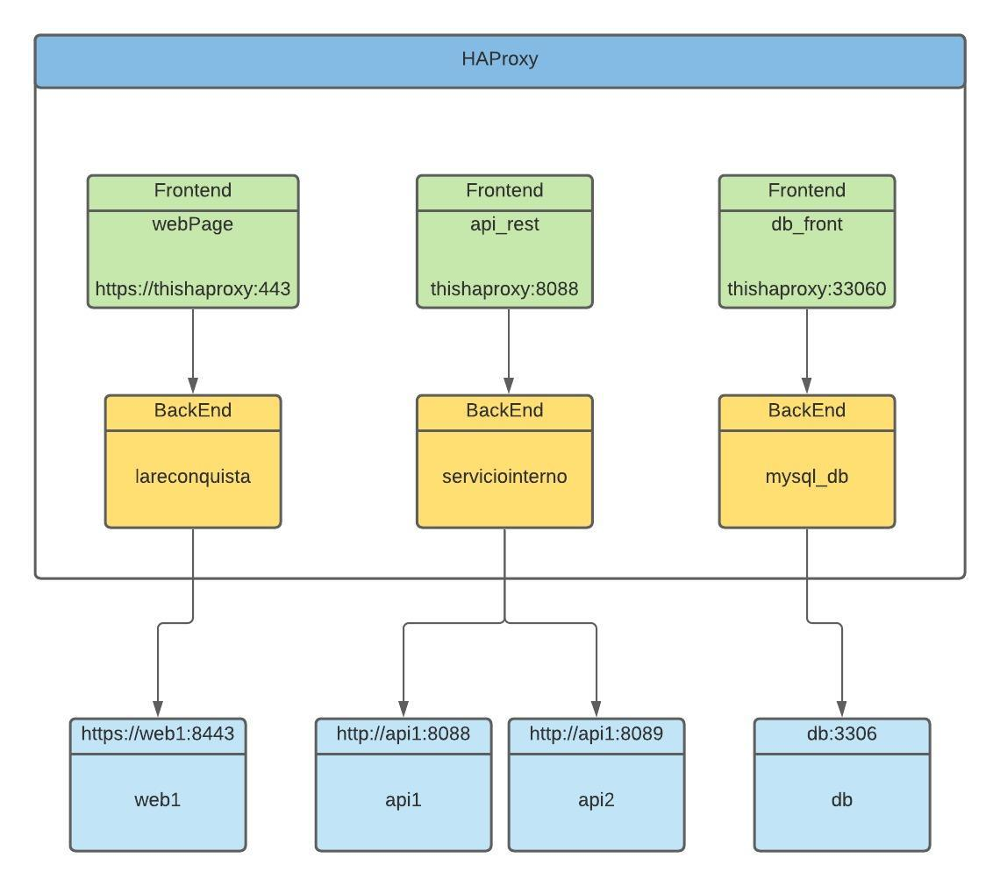

y la siguiente comunicación:

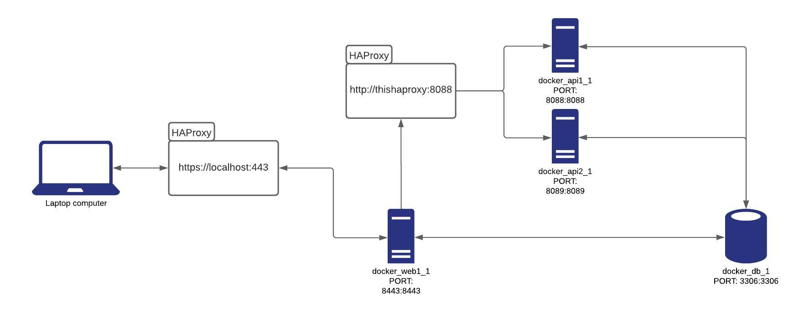


Para desplegar el servicio tenemos que descargarnos el zip descomprimirlo e ir a la carpeta docker donde abriremos un terminal e introduciremos la siguiente línea

```
$ sudo docker-compose up
```

Para mostrar las imagenes tenemos el mandato

```
$ sudo docker images
```

Para los ids:

```
$ sudo docker ps
```

Y para detener un proceso usaremos:

```
$ sudo docker stop [id]
```

