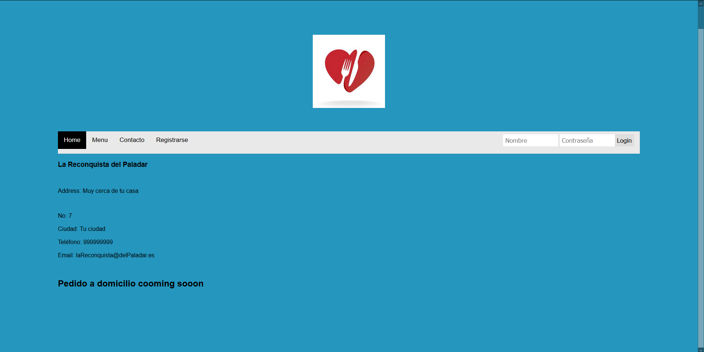

# La Reconquista Del Paladar #

## Índice ##

1. [Fase 1](#id1)
2. [Fase 2](#id2)

## Fase 1 <a name="id1"><a> ##
### Descripción general ###
Se desarrollará una aplicación web destinada a la venta de comida latinoamericana a domicilio, en la que los usuarios podrán navegar por las diferentes categorías de las comidas ofertadas sin necesidad de registrarse. Para formalizar el pedido deberán iniciar sesión con su usuario y completar su compra.

### Entidades principales ####
- Producto: Cada producto llevará asociado un identificador único, y contendrá datos específicos que lo describan junto al número de stock. 
- Cliente: Cada ususario tendrá su propio nombre de usuario, que será unico para cada uno, a parte de otros datos como su dirección y otros datos personales. El usuario podrá realizar de 0 a N pedidos.
- Pedido: esta entidad tendrá asociada un numero de productos y un usuario, asociandolos. Esta entidad tambien contendrá el coste final total.
- Categoría de productos: esta entidad llevará asosciado un identificador único y contendrá de 1 a N productos que se recojan en ella.

### Descripción servicio interno ###
\- Cuando el usuario hace un pedido se le enviará un correo electrónico con un pdf donde se incluirá el resumen de su pedido.

\- Servicio de pago online.

### Autores ###

**Roberto Adrián Toaza Castro**
- ra.toaza.2016@alumnos.urjc.es
- GII + GIC 129
- ##### Github: [RoberToaza](https://github.com/RoberToaza)

## Fase 2  ##

### Desarrollo en local ###
#### Diagrama de Navegación ####

#### Diagrama UML ####

#### Diagrama E/R ####

#### Home Principal ####

#### Home (Privado) ####

#### Menú (Público) ####

#### Menú (Privado)####

A diferencia del menú anterior. este dispone de un botón para poder añadirlo al carrito del usuario.

#### Carrito (Privado) ####

#### Contacto (Publico/Privado) ####

Lo único que diferencia a estos dos es que en uno puedes hacer login en la barra nav y en el otro aparece tu nombre de usuario

#### Info (Privado) ####

#### Registrarse como usuario (Publico) ####

